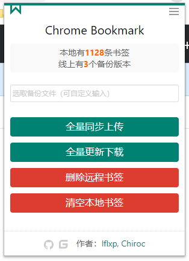
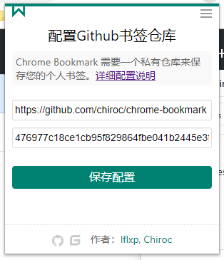

#### 介绍
> Chrome自定义书签，一个不需要VPN就能访问的书签工具！
>
> 该扩展插件的目的是替代chrome书签同步功能，解决因无法翻墙导致书签无法同步或同步不及时的问题。

[Github项目](https://github.com/CLDeveloping/chrome-bookmark) | [Gitee项目](https://gitee.com/CLCoding/chrome-bookmark)

 

### 主要功能内容有

- **书签全量同步上传：** 初次同步书签先在【选取备份文件】框内输入想要备份的文件名，然后点击【全量同步上传】，成功后页面内和系统通知信息进行操作通知
- **书签全量更新下载：** 重新点击【chrome浏览器书签同步管理工具】按钮，选取【备份文件】下拉框，选取需要恢复的备份文件名然后点击【全量更新下载】即可
- **书签远程多版本的存储管理和删除：** 选取【备份文件】下拉框，选取需要删除的备份文件名，点击【删除远程书签】按钮
- **书签本地清空：** 提供全量清楚本地书签的功能
- 书签统计

**注意：**
> 为确定万无一失，在使用本书签工具前请先前往chrome浏览器书签管理器中导出所有书签并妥善保管！
>
> 本书签工具不会收集个人用户任何信息和书签内容，请放心使用！所有数据将托管于用户自建的代码服务器中。

#### 安装步骤

步骤：
- 创建一个书签项目[Github私有仓库](https://github.com/new)，项目名称不限
- 获取Github项目[私有访问Token](https://github.com/settings/tokens)（如何获取：Github -> Settings -> Developer settings -> Personal access tokens -> Generate new token）
- 下载当前书签项目完整源代码
- 直接在浏览器地址栏输入：`chrome://extensions/`，进入扩展程序管理界面
- 点击【加载已解压的扩展程序】-> 选择项目根目录，导入源码文件夹
- 完成后书签工具会显示在浏览器地址栏旁
- 点击书签工具配置书签
  - 在配置界面输入第一、二步创建的仓库地址（如：https://github.com/xxx/chrome-bookmark）及访问Token
  - 点击【保存配置】后完成配置退出工具界面
  - 重新点击书签图标工具，回到主界面进行书签管理

#### 工作原理
> 本项目采用github私有仓库作为远程存储仓库，利用github api进行书签全量文件的备份和版本管理工作。采用github作为后端存储有以下好处：

- 永久免费试用
- 大容量
- 版本控制
- 私有仓库保证安全性，权限范围可控
- 全世界可达，不受网络影响
- 无运营成本
- 全程https协议传输数据
